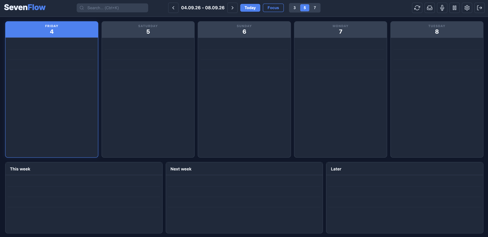
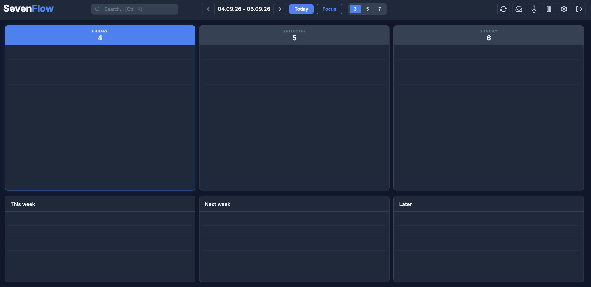

<p align="center">
  
</p>

<p align="center">
  <strong>A calm, open-source weekly planner for people who want to see their work instead of managing a database of tasks.</strong>
</p>

<p align="center">
  <a href="#why-sevenflow">Why</a> |
  <a href="#features">Features</a> |
  <a href="#quick-start-local-mode">Quick start</a> |
  <a href="#docker">Docker</a> |
  <a href="#android-app-coming-soon">Android</a> |
  <a href="#self-hosting">Self-hosting</a> |
  <a href="#plugins">Plugins</a>
</p>

<p align="center">
  
</p>

# SevenFlow

SevenFlow is an open-source task planning app built around a simple idea: your week should be visible, lightweight, and easy to adjust.

It is designed for people who prefer visual weekly planning, fast task capture, and a self-hostable workflow without project-management ceremony.

SevenFlow supports two operating modes:

- Hosted mode with Firebase and optional Netlify Functions.
- Local self-hosted mode with the bundled Node server and JSON file storage.

The original hosted Firebase/Netlify setup remains supported. The local mode is intended for people who want to run SevenFlow on their own computer or server without creating Firebase or Netlify accounts.

## Why SevenFlow

SevenFlow was built because many task apps become too heavy for everyday planning. They are powerful, but they often force you to think in projects, statuses, priorities, databases, and dashboards before you have even decided what you want to do today.

SevenFlow takes the opposite approach:

- Plan visually across a few days instead of hiding everything in lists.
- Capture unscheduled tasks in an inbox without polluting the week.
- Keep recurring tasks simple and predictable.
- Move work between today, tomorrow, backlog, and inbox quickly.
- Keep the core app small, with optional integrations handled through plugins.

It is not trying to replace a full project-management suite. It is meant to be the place where your week becomes clear.

## App Preview

### 5 Day View

<p align="center">
  
</p>

### 3 Day Focused View

<p align="center">
  
</p>

## Android App Coming Soon

An Android app already exists and is being tested, but it still needs final polishing before it is published as part of the open-source release. The web app is the first public target; Android support is planned to follow soon.

## Features

- Weekly task planning with desktop 3, 5, or 7 day views.
- Mobile-friendly 1, 3, or 5 day views.
- Inbox for tasks that are not scheduled yet.
- Three backlog columns for flexible planning beyond the visible week.
- Optional notepad area instead of backlog columns.
- Recurring tasks, including daily, weekly, monthly, yearly, and biweekly tasks.
- Reminders, tags, deadlines, colors, subtasks, and attachments.
- Drag and drop sorting across days, backlog, and inbox.
- Quick actions for moving tasks to today, tomorrow, inbox, or backlog.
- Search by title and task content.
- Backup export/import as JSON.
- Optional Ramble plugin for voice/text task capture.
- Optional task API plugin for creating and reading tasks.
- Optional Google Calendar sync plugin.
- Optional Google Login plugin.

## Quick Start: Local Mode

Run SevenFlow without Firebase and without Netlify:

```bash
npm install
npm run start:local
```

Then open:

```text
http://127.0.0.1:8000/login.html
```

Default local credentials:

```text
Email: admin@sevenflow.local
Password: sevenflow
```

Local data is stored in:

```text
.sevenflow-data/data.json
```

Change the credentials with environment variables before exposing the server to another device or network.

## Docker

The quickest self-hosted setup is the bundled Docker Compose file. It runs SevenFlow in local JSON mode, without Firebase and without Netlify. Make sure Docker is running first.

```bash
docker compose up --build
```

Then open:

```text
http://localhost:8000/login.html
```

Default Docker credentials:

```text
Email: admin@sevenflow.local
Password: sevenflow
```

Data is persisted in the Docker volume `sevenflow-data`, mounted at `/app/.sevenflow-data` inside the container.

Before exposing SevenFlow to a network, change at least these values in `docker-compose.yml`:

- `SEVENFLOW_LOCAL_USER_EMAIL`
- `SEVENFLOW_LOCAL_USER_PASSWORD`
- `SEVENFLOW_LOCAL_SESSION_SECRET`

## Hosted Firebase Setup

Install dependencies:

```bash
npm install
```

Copy the environment example:

```bash
cp .env.example .env
```

Fill in your Firebase and optional integration values in `.env`, then generate the runtime Firebase config:

```bash
npm run build
```

Start a local static server:

```bash
python3 -m http.server 8000
```

Then open:

```text
http://localhost:8000
```

This static mode is enough for the app UI, Firebase login, and Firebase sync. API routes such as `/api/tasks/create` need the bundled `task-api` plugin plus either Netlify Functions or the self-hosted Node server.

## Self-Hosting

SevenFlow can run on Linux, macOS, or Windows with Node.js.

For the Firebase-backed app plus local API routes:

```bash
npm install
npm start
```

The server:

- Generates `js/firebase-config.js` from `.env`.
- Serves the static app.
- Exposes plugin API routes under `/api/...` when the related plugin is enabled.

Open:

```text
http://localhost:8000
```

Or set another port:

```bash
PORT=3000 npm start
```

For a small private server, put this Node process behind a reverse proxy such as Caddy, nginx, Apache, or a hosting panel that can forward HTTPS traffic to the Node port.

For the Firebase-free JSON-backed mode:

```bash
npm run start:local
```

Useful local mode variables:

- `SEVENFLOW_LOCAL_USER_EMAIL`
- `SEVENFLOW_LOCAL_USER_PASSWORD`
- `SEVENFLOW_LOCAL_USER_ID`
- `SEVENFLOW_LOCAL_SESSION_SECRET`

## Firebase Data Model

SevenFlow stores data under the signed-in user:

- `users/{uid}/tasks/{YYYY-MM-DD}`
- `users/{uid}/backlogs/data`
- `users/{uid}/backlogs/titles`
- `users/{uid}/settings/preferences`

Deploy the included Firestore and Storage rules before using the app with real users.

## Plugins

Optional integrations are documented on their own page: [`docs/plugins.md`](docs/plugins.md).

Bundled plugins include Ramble, task API, Google Login, and Google Calendar. Enable only what you need with `SEVENFLOW_PLUGINS`.

## Backend Modes

Hosted Firebase mode:

- Authentication: Firebase Auth.
- Database: Firestore.
- Files: Firebase Storage.
- API admin access: Firebase Admin SDK.

Local JSON mode:

- Authentication: Local Node server session.
- Database: `.sevenflow-data/data.json`.
- Files: Local mode does not aim to replace production file storage yet.
- API: Disabled in the UI for local mode while the hosted API remains available for Firebase mode.

## Future Direction

SevenFlow is moving toward a clearer adapter and plugin architecture:

- `firebase` adapter for the current hosted version.
- `self-hosted` adapter with server-side auth, SQLite or Postgres, and local/S3-compatible file storage.
- One shared client contract for tasks, settings, backlogs, inbox, recurring tasks, and attachments.
- Optional integrations distributed as plugins instead of being hardwired into the core app.

Loading untrusted third-party plugins directly in the browser is not recommended until the security model is explicit.

## Checks

Run the JavaScript syntax check:

```bash
npm run check:js
```

Run the Firestore rules and API helper tests:

```bash
npm run test:rules
```

## Documentation

- `docs/self-hosting.md`: Self-hosting notes.
- `docs/plugins.md`: Bundled plugin setup.
- `docs/backend-adapters.md`: Backend adapter direction.
- `docs/publishing.md`: Public GitHub publishing checklist.

## License

MIT

